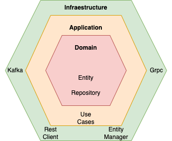

# NFD demo

The project follows [hexagonal ("ports and adapters") architecture](https://romanglushach.medium.com/hexagonal-architecture-the-secret-to-scalable-and-maintainable-code-for-modern-software-d345fdb47347).


## Run
```bash
docker-compose up --build
```

## Tech stack
Powered by [Guice](https://github.com/google/guice) IOC container library, [Ktor(Server + Client)](https://ktor.io/) kotlin web framework, Gradle and Docker